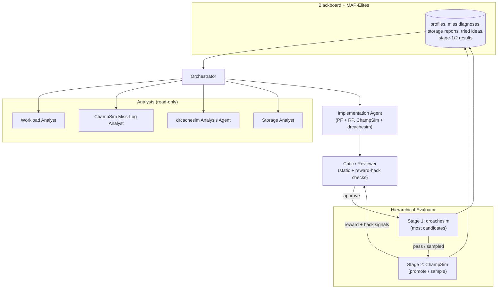
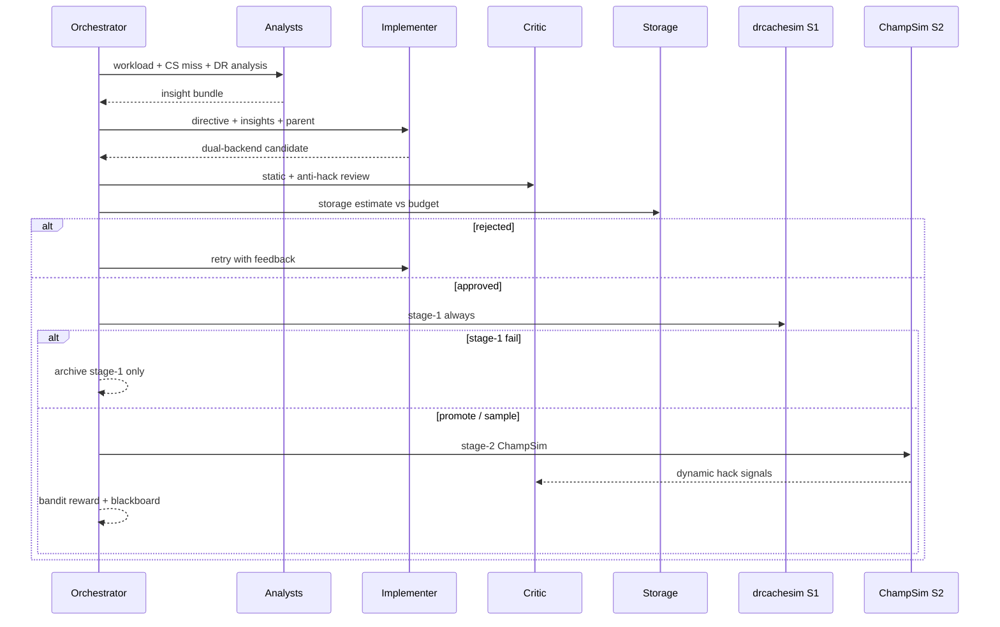

# Hierarchical Dual-Simulator Agentic Workflow

Design doc for evolving the combined PF+RP agentic workflow to a
**hierarchical evaluator** (drcachesim → ChampSim), a **unified implementer**,
and new **storage / reward-hacking / drcachesim analysis** agents.

Status: proposal / design. Builds on
[`docs/multi_agent_codesign.md`](multi_agent_codesign.md) (Phases 0–3 shipped).
Owner: (you). Last updated: 2026-07-19.

---

## 1. Motivation

The current Mode C loop (`workflows/combined/`) co-evolves L2C prefetcher +
replacement via separate PF/RP engineer agents, a static critic, ChampSim-only
evaluation, and analysts that consume ChampSim miss logs / offline profiles.

Limitations this design addresses:

1. **Evaluation cost dominates.** Every candidate pays a full ChampSim rebuild +
   multi-trace run. A cheaper first filter would let the search try more ideas.
2. **Split implementers fight the co-design goal.** Prefetcher and replacement
   engineers edit in isolation; coupling is only a metadata regex. One agent that
   owns both halves can reason about the handshake in one pass.
3. **Storage budget is prompt-only.** Config says “a few KB”; nothing measures
   table sizes / bits-per-line against a hard budget before scoring.
4. **Reward hacking is unchecked.** Score is mean IPC on the training traces.
   Agents can overfit, inflate useless prefetches that happen to help one
   workload, or game stats without real reuse improvement.
5. **drcachesim is offline tooling only.** Trace conversion
   (`scripts/champsim_l2_to_drcachesim.py`) exists but is not in the loop; there
   is no drcachesim analysis feed for the orchestrator.

---

## 2. Goals & non-goals

**Goals**

- Hierarchical evaluation: **drcachesim first (frequent / cheap)**, ChampSim
  second (**occasional / expensive confirmation**).
- One **Implementation Agent** that edits **both** prefetcher and replacement
  for **both** ChampSim and drcachesim targets (no separate PF vs RP agents).
- A **Storage Analyst** that estimates hardware storage from code and gates
  candidates that exceed budget.
- Critic / reviewer extended to detect **reward-hacking patterns** (static +
  post-eval signals).
- A **drcachesim Analysis Agent** that turns drcachesim stats into insights for
  the implementer (parallel to today’s ChampSim miss-log analyst).

**Non-goals (for this revision)**

- Replacing OpenEvolve’s MAP-Elites / archive mechanics.
- Editing DynamoRIO or ChampSim upstream cores beyond thin shims under
  `openevolve-components/` (same convention as today).
- Full RTL / ASIC mapping; storage accounting stays at behavioral C++ estimates.
- Perfect cycle-accurate parity between drcachesim stage-1 scores and ChampSim
  IPC (stage-1 is a **filter / ranker**, not a substitute).

---

## 3. Target architecture



### Agent roster (delta vs today)

| Role | Today | Proposed |
|------|-------|----------|
| Prefetcher engineer | Separate LLM | **Removed** |
| Replacement engineer | Separate LLM | **Removed** |
| Implementation agent | — | **New**: single LLM edits PF+RP for ChampSim and drcachesim |
| Storage analyst | Soft prompt only | **New**: parse/estimate storage; hard gate |
| Critic | Markers, APIs, forbidden I/O/`new`, metadata regex | **Extend**: reward-hacking checklist + consume post-eval flags |
| ChampSim miss-log / workload analysts | Exist | Keep |
| drcachesim analysis agent | — | **New** |
| Evaluator | ChampSim only | **Cascade**: drcachesim → ChampSim |

---

## 4. Hierarchical evaluator

### 4.1 Policy

Use OpenEvolve’s cascade hooks (`evaluate_stage1` / `evaluate_stage2`,
`cascade_evaluation: true`) in `workflows/combined/`:

| Stage | Simulator | When | Objective (approx.) | Failure |
|-------|-----------|------|---------------------|---------|
| **1** | drcachesim | **Every** candidate that passes critic + storage gate | IPC proxy: demand L2/LL MPKI reduction vs baseline, with traffic / useless-prefetch penalties | Reject; no ChampSim |
| **2** | ChampSim | **Periodic**: every 10 search iterations by default | Mean IPC (+ existing MPKI side metrics) | Archive with stage-1 score only; do not promote to “best” without stage-2 |

Default knobs (env / `config.yaml`):

- `HIER_STAGE2_EVERY_N=10` — run ChampSim every N OpenEvolve search iterations.
- `HIER_STAGE1_THRESHOLD` — minimum stage-1 score vs baseline to pass cascade.

At a ChampSim iteration, evaluate the best drcachesim-qualified candidate
accumulated since the previous ChampSim run. If no candidate passed stage 1,
skip that ChampSim run rather than evaluating a known-bad candidate. The
cadence is configurable, but 10 iterations is the normal operating point.

**drcachesim does not report IPC.** It replays memory references through a
cache hierarchy but does not model the CPU pipeline, execution cycles,
memory-level parallelism, branch behavior, or latency overlap. Stage 1
therefore ranks candidates using an **IPC proxy**, never IPC itself.

**Invariant:** official leaderboard / “best program” promotion requires a
**ChampSim stage-2** score. Stage-1 alone never crowns a winner. A candidate
may replace the running best only if its aggregate ChampSim IPC is greater
than the running best's aggregate ChampSim IPC; a better stage-1 proxy score
cannot override a ChampSim IPC regression.

### 4.2 Stage-1 plumbing

Reuse existing L2→drmemtrace path:

1. Offline (or cached) produce drmemtrace files via
   `scripts/run_champsim_l2_drcachesim_trace.sh` for the training workload set.
2. For each candidate, build/load the **drcachesim policy shim** (replacement +
   prefetcher backends emitted by the implementer).
3. Run `drrun -t drmemtrace ... -simulator_type cache` (or the project’s
   custom simulator binary if we ship one) with fixed warmup/sim refs from
   `*.counts.json`.
4. Parse demand misses, hits, prefetch usefulness (when available), and traffic.
5. Compute a baseline-relative proxy, initially based on demand L2/LL MPKI
   reduction with penalties for excess traffic and useless prefetches →
   `stage1_score`.

ChampSim stage-2 stays the current combined evaluator path
(`workflows/combined/evaluator.py` → split markers → rebuild → traces).

### 4.3 Dual-backend candidate artifact

The combined source (or a sibling package) must carry **two backends**:

```
// === OPENEVOLVE_PREFETCHER_BEGIN ===   # ChampSim PF (unchanged markers)
// === OPENEVOLVE_REPLACEMENT_BEGIN ===  # ChampSim RP

// === OPENEVOLVE_DR_PREFETCHER_BEGIN ===   # NEW: drcachesim PF
// === OPENEVOLVE_DR_REPLACEMENT_BEGIN ===  # NEW: drcachesim RP
```

ChampSim halves continue to compile as separate TUs (no shared globals).
drcachesim halves compile into the DynamoRIO cache-sim extension (subclass
`cache_replacement_policy_t` and the prefetcher plugin ABI — see §4.4).

The Implementation Agent may keep algorithms aligned across backends (same
tables / confidence encoding) even when APIs differ.

### 4.4 drcachesim backend: implementation status

DynamoRIO is pinned as the `DynamoRIO/` submodule at
`25ad71237ceab5f536518ecdcca51b0ed077e914` (`cronbuild-11.91.20651`).
Investigation corrected an earlier assumption: this upstream version already
has an **in-process** custom prefetcher API:

- Subclass `dynamorio::drmemtrace::prefetcher_t` and override
  `prefetch(caching_device_t*, const memref_t&, bool missed)`.
- Implement `prefetcher_factory_t::create_prefetcher(int block_size)`.
- Pass the factory to `cache_simulator_t`; drcachesim calls the prefetcher for
  every demand access and supplies whether it missed.

Upstream's normal CLI could not load that factory. The local DynamoRIO patch
adds the missing extension path:

- `-prefetcher_plugin /path/to/policy.so` implies
  `-data_prefetcher custom`.
- The shared library exports a versioned ABI:
  `drcachesim_prefetcher_plugin_abi_version`,
  `drcachesim_create_prefetcher_factory`, and
  `drcachesim_destroy_prefetcher_factory`.
- The simulator validates ABI version 1, owns the factory for the complete
  cache-simulator lifetime, destroys all prefetcher instances before unloading
  the library, and reports load/symbol/version failures as initialization
  errors.
- `openevolve-components/drcachesim/example_prefetcher_plugin.cpp` demonstrates
  a two-next-line policy; `scripts/build_drcachesim_prefetcher_plugin.sh`
  compiles any evolved plugin source.
- Prefetcher headers (`prefetcher.h`, `prefetcher_plugin.h`,
  `caching_device.h`, `caching_device_block.h`) are installed alongside the
  existing replacement-policy headers so out-of-tree plugins can build against
  an installed DynamoRIO tree.

Replacement remains a separate `cache_replacement_policy_t` backend. The
remaining dual-backend work is to port the IPCP seed into this plugin ABI and
port DRRIP into the replacement API; no `cache_t` fork is required.

### 4.5 Score fusion for the bandit

- Most bandit updates use **stage-1 proxy delta** (fast feedback). These updates
  steer exploration but do not represent measured IPC.
- When stage-2 runs, update with **ChampSim IPC delta** (authoritative) and
  record `stage1_vs_stage2` residual for calibration / reward-hack detection
  (large stage-1 gain + flat/negative ChampSim IPC → suspicious).
- Persist paired observations
  `(drcachesim features, ChampSim IPC delta)` from every stage-2 run. Once
  enough pairs exist, fit a simple regularized linear model that predicts IPC
  delta from demand MPKI, traffic, and prefetch-usefulness deltas. Use the
  prediction only to improve stage-1 ranking; retain the raw proxy as a
  fallback and never expose predicted IPC as measured IPC.
- Refit the calibration model after each periodic ChampSim run and record its
  error. If recent prediction error or rank correlation becomes unacceptable,
  reduce stage-1's bandit weight and continue using ChampSim as the sole
  promotion signal.

---

## 5. Unified Implementation Agent

### 5.1 Role

Replace `agents/engineer.py`’s dual `PF_SYSTEM` / `RP_SYSTEM` paths with one
agent:

- **Input:** orchestrator directive, insight bundle (workload + ChampSim miss
  log + drcachesim analysis + storage report), parent combined source, optional
  critic feedback.
- **Output:** SEARCH/REPLACE (or section-scoped) edits that may touch **any** of
  the four evolve regions in one response, or a structured multi-hunk diff.
- **Responsibility:** keep PF↔RP metadata contract consistent **and** keep
  ChampSim ↔ drcachesim algorithmic intent consistent when the directive is
  “joint”.

### 5.2 Directive modes (updated)

| Mode | What the implementer may edit |
|------|-------------------------------|
| `joint` | All four regions (preferred default) |
| `algorithm_only` | ChampSim + matching drcachesim regions for the same idea |
| `champsim_only` | ChampSim PF+RP (rare; e.g. stage-2 fixups) |
| `drcachesim_only` | drcachesim PF+RP (rare; stage-1 repair) |

Remove `prefetcher_only` / `replacement_only` as separate *agents*. If the
bandit still wants PF-skewed vs RP-skewed plays, encode that as **focus text**
inside a single implementer call (“prioritize replacement victim choice; only
touch PF metadata if needed”), not as a second agent.

### 5.3 Orchestrator change

`node_engineer_and_critic` becomes `node_implement_and_gate`:

1. Storage Analyst on parent (and optionally on draft).
2. One Implementation Agent call.
3. Critic (static + reward-hack static checks).
4. Storage Analyst on child (hard fail if over budget).
5. Retry loop with combined critic + storage feedback (`OPENEVOLVE_CRITIC_RETRIES`).

---

## 6. Storage Analyst

### 6.1 Role

Deterministic-first agent (LLM optional for ambiguous macros) that:

1. Parses evolve blocks for arrays, bitfields, per-set / per-line state.
2. Estimates **bytes of stateful storage** (tables, RRPV arrays, history,
   prefetch filters) under documented assumptions (set counts, ways, line size
   from ChampSim / drcachesim configs).
3. Compares against `STORAGE_BUDGET_BYTES`. The rollout default is **128 KiB**
   so the IPCP+DRRIP seed remains admissible (estimated at 114,842 bytes);
   experiments should explicitly tighten this when targeting a smaller
   hardware budget. PF+RP are counted once per logical design as described
   below.

### 6.2 Accounting rules

- Count **ChampSim PF + ChampSim RP** storage as the primary budget (hardware
  L2 structures).
- drcachesim backend should **mirror** the same sizes; if it allocates more,
  flag as inconsistency (critic / storage fail), not as free extra budget.
- Reject: unbounded vectors, growing maps, per-address `unordered_map` without
  fixed capacity, `new`/`malloc` in hot path (overlap with critic).
- Soft metrics: emit `storage_bytes`, `storage_budget_ratio` into evaluation
  artifacts for MAP-Elites feature dimensions later.

### 6.3 Gate position

**Before stage-1.** Over-budget candidates never burn simulator time.

---

## 7. Critic: reward-hacking checks

Keep existing static checks (markers, headers, required methods, forbidden I/O,
metadata contract). Add:

### 7.1 Static (pre-build)

Flag / reject patterns that typically game the evaluator without modeling real
cache behavior, for example:

- Writing to stats-only side channels; file I/O; reading the miss-log path.
- Trace-name / workload-id branching (`if (trace)`, hardcoded PCs from one
  SPEC binary) unless allowlisted for experiments.
- Enormous prefetch blast with no confidence gating when directive did not ask
  for coverage expansion.
- Divergent ChampSim vs drcachesim logic that only improves the simulator that
  is about to run (detect large AST/hash mismatch between paired regions when
  mode is `joint`).
- Comments / dead code that encode evaluation thresholds or baseline IPC
  constants.

### 7.2 Dynamic (post-eval, feed next round + optional reject-from-archive)

Signals computed in the evaluator and attached to blackboard / critic context:

| Signal | Suspicious if |
|--------|----------------|
| Prefetch accuracy | Very low accuracy but IPC↑ on one trace only |
| `pf_useless` / `pf_issued` | Huge issue rate with tiny useful fraction |
| Held-out / secondary trace delta | Train↑, holdout↓ (when multi-trace enabled) |
| Stage-1 vs stage-2 residual | Large positive stage-1, non-positive ChampSim IPC |
| Storage | Near-budget explosion coinciding with tiny IPC gain |
| Per-PC miss concentration | Wins only on a tiny PC set that matches hardcoded branches |

Critic does not need to be a full LLM jury every time: start with **rules +
thresholds**; optional LLM “review pass” when rules fire gray-zone.

### 7.3 Interaction with promotion

Candidates that fail dynamic reward-hack checks are recorded as
`outcome=reward_hack_suspected`, do not update “best”, and add a tried-idea
dead-end note so the implementer avoids repeating the exploit.

---

## 8. drcachesim Analysis Agent

### 8.1 Role

Parallel to `agents/miss_log.py`, but for stage-1 / offline drcachesim outputs:

- **Input:** drcachesim stats text/JSON, optional baseline run, config (sizes,
  replace_policy, prefetcher).
- **Output:** structured hypotheses for the insight bundle, e.g.
  - L1D vs LL miss shift
  - Prefetch usefulness (if exposed)
  - Set-conflict vs capacity hints from miss rates vs associativity
  - Comparison to ChampSim L2 MPKI on the same workload (cross-sim sanity)

### 8.2 When it runs

- After each stage-1 eval (cached on blackboard per candidate hash).
- Offline baseline generation script (mirror
  `scripts/generate_baseline_miss_logs.py` for drcachesim).

### 8.3 Insight Service

Extend `insight_service.py` / `build_insight_bundle` with a
`=== drcachesim analysis ===` section so the Implementation Agent sees both
simulators’ diagnoses.

---

## 9. End-to-end generation loop



---

## 10. Config & file layout (proposed)

```
docs/hierarchical_dual_sim_workflow.md          # this doc
workflows/combined/
  agents/
    implementer.py          # replaces dual engineer entrypoints
    storage.py              # storage analyst
    drcachesim_analysis.py  # new analyst
    critic.py               # extended reward-hack checks
    engineer.py             # deprecate or thin wrapper → implementer
  evaluator_cascade.py      # stage1/stage2 entrypoints (or extend evaluator.py)
  config.yaml               # cascade_evaluation: true, budgets, stage-2 knobs
openevolve-components/
  drcachesim/               # shims: custom replace + prefetch hooks
scripts/
  generate_baseline_drcachesim.py
  run_drcachesim_candidate.sh
```

Env knobs (additive):

| Variable | Purpose |
|----------|---------|
| `OPENEVOLVE_HIERARCHICAL_EVAL` | Enable cascade |
| `HIER_STAGE2_EVERY_N` | ChampSim cadence; default `10` iterations |
| `STORAGE_BUDGET_BYTES` | Hard storage cap |
| `OPENEVOLVE_REWARD_HACK_CHECKS` | Enable dynamic critic signals |
| `OPENEVOLVE_UNIFIED_IMPLEMENTER` | Feature flag during migration |

---

## 11. Phased rollout

### Phase H0 — Design & scaffolding
- [x] Land this design doc; use a 10-iteration stage-2 cadence and the marker
      names in §4.3.
- [x] Run the drcachesim spike, scoped below.

#### H0 spike — scope & estimate

Goal: prove the drcachesim backend is buildable and produces a usable stage-1
signal, and decide the prefetcher approach before locking marker APIs. Timebox
~3–5 engineer-days.

| # | Task | Output / exit criterion | Est. | Risk |
|---|------|-------------------------|------|------|
| S0 | **Done:** vendor + build pinned DynamoRIO; run stock `drcachesim` on an existing converted L2 `drmemtrace` | Pinned submodule and successful `drmemtrace_launcher` / unit-test build; trace run remains with H1 plumbing | 0.5d | Low |
| S1 | **Done:** define & parse the stage-1 stat schema from `drcachesim` output (per-level miss rate, misses, hits, prefetch hits, traffic) → JSON | `drcachesim_stats.py::parse_drcachesim_stats()` + fixture tests | 0.5d | Resolved |
| S2 | **Done:** baseline sweep: LRU/LFU/FIFO × `nextline`/`none` on available training traces | `scripts/generate_baseline_drcachesim.py`; missing trace payloads are reported rather than silently ignored | 0.5d | Resolved |
| S3 | **Resolved upstream:** pinned DynamoRIO already contains tested RRIP implementations behind `cache_replacement_policy_t`; candidate-specific plugin plumbing is H1b | Existing RRIP unit tests pass in the pinned build | 1d | Resolved |
| S4 | **Done:** expose upstream `prefetcher_t` / `prefetcher_factory_t` through a versioned CLI shared-library plugin loader | `-prefetcher_plugin` loads a custom policy; example plugin + integration test; no `cache_t` fork | 1d | Resolved |
| S5 | **Moved to H4:** correlate drcachesim feature deltas with ChampSim IPC deltas once periodic paired evaluations exist | Calibration module + report in Phase H4 | 0.5d | Data-dependent |

Decision gates out of H0:

- **S4 resolved:** proceed to the full dual-backend (§4.3, Phase H1b) with both
  `OPENEVOLVE_DR_*` markers. Implement evolved prefetchers as plugin libraries;
  no `cache_t` fork or built-in-prefetcher fallback is needed.
- If **S5 correlation is poor** even at the cache level → reconsider whether
  drcachesim adds value over a cheaper analytic proxy before investing in H1b.

### Phase H1 — Hierarchical eval (ChampSim policies unchanged)
- [x] Wire `evaluate_stage1` to run drcachesim and emit a baseline-relative
      proxy metric; report unavailable trace payloads without disabling
      periodic ChampSim.
- [x] Run stage 2 on the first evaluation and every 10 evaluations thereafter
      by default; keep measured ChampSim IPC above proxy-only candidates.
- [x] Enable OpenEvolve cascade in `workflows/combined/config.yaml`.

### Phase H1b — Dual-backend artifact
- [x] Add DR PF/RP markers, seed implementations, split validation, and cached
      candidate-plugin builds.
- [x] Stage 1 runs the **candidate** drcachesim PF+RP through versioned plugin
      ABIs on an L2C→LLC hierarchy sized from ChampSim `L2C`/`LLC`, and parses
      demand / prefetch stats into proxy metrics (memory-facing LLC when present).

### Phase H2 — Unified implementer
- [x] Replace PF/RP engineer dual-calls with one Implementation Agent owning all
      four policy sections.
- [x] Update orchestrator, agentic-mutation fallback, tests, and prompts.
- [x] Bandit plays select focus text for one implementation call, not separate
      component agents.

### Phase H3 — Storage + reward-hack + DR analysis
- [x] Deterministic Storage Analyst gate + metrics before simulator work and
      inside the implement/revise loop.
- [x] Critic static anti-hack rules; post-evaluation dynamic signals; blackboard
      `reward_hack_suspected` outcomes that suppress bandit reward/promotion.
- [x] drcachesim Analysis Agent + insight-bundle section.
- [x] Baseline drcachesim stats sweep script.

### Phase H4 — Rigor
- [x] Fit and continuously validate a persisted ridge model from drcachesim
      features to ChampSim IPC delta; trust it only after enough pairs and
      acceptable rank correlation.
- [x] Support held-out trace patterns and train-up/held-out-down hack detection.
- [x] Add a reproducible ablation runner for unified implementer vs native
      OpenEvolve mutator and with/without the stage-1 filter.

### Phase H5 — DPC4 alignment & search guidance (todo)
- [ ] **Add Vizier** (or equivalent) for outer-loop / hyperparameter search,
      and **modify prompts** so the Implementation Agent must **not tune
      numeric parameters** as the primary mutation strategy (prefer structural /
      algorithmic changes; leave continuous knob search to Vizier).
- [ ] **Modify prompts** (`config.yaml` system message, implementer / critic /
      directive templates) to **list and enforce rules from the DPC4 website**,
      especially [Championship Rules](https://sites.google.com/view/dpc4-2026/submit-work/rules)
      (storage budgets L1D 32 KB / L2 128 KB / LLC 256 KB; one PF per level;
      no ChampSim core changes; single parameter set across configs with
      dynamic adaptation via DPC APIs only; evaluation methodology). Also
      cross-link [Infrastructure](https://sites.google.com/view/dpc4-2026/submit-work/infrastructure)
      and the home site: https://sites.google.com/view/dpc4-2026/home

---

## 12. Risks & open questions

1. **drcachesim plugin ABI coupling.** The pinned upstream already exposes
   `prefetcher_t` / `prefetcher_factory_t`; the local patch makes it loadable
   from the CLI. Because the ABI passes C++ objects across a shared-library
   boundary, plugins must be compiled against the same pinned DynamoRIO headers
   and compatible C++ runtime. The explicit ABI version catches protocol
   changes, not every C++ ABI mismatch. Keep the DynamoRIO revision pinned and
   rebuild evolved plugins whenever it changes.
2. **Semantic gap.** L2 drmemtrace from ChampSim already reflects upper-level
   filtering; drcachesim stage-1 is not full-system IPC. Treat as ranker only.
3. **Dual maintenance.** One agent editing four regions may drift backends.
   Mitigate with storage parity checks + joint-mode similarity / shared
   “algorithm card” in the directive.
4. **Cost of implementer context.** One big prompt vs two smaller ones — monitor
   tokens; allow section-scoped edits when the directive is narrow.
5. **Reward-hack false positives.** Start in `report-only` mode before hard
   reject.
6. **Proxy error.** Stage 1 starts with baseline-relative demand L2/LL MPKI plus
   traffic / useless-prefetch penalties. Periodic ChampSim results fit a simple
   regularized IPC-delta predictor. Prediction remains a ranker only: measured
   ChampSim IPC is always authoritative, and IPC regressions cannot become the
   running best.

---

## 13. Success criteria

- Roughly 90% of search iterations use drcachesim only; ChampSim runs every
  10 iterations when a stage-1-qualified candidate is available.
- Storage gate blocks clearly oversized tables before any sim run.
- Single implementer produces valid ChampSim + drcachesim sections that pass
  critic round-trip tests.
- At least one held-out / residual-based reward-hack rule catches a synthetic
  exploit fixture in unit tests.
- Insight bundle includes a non-empty drcachesim analysis section on stage-1
  completion.
- No candidate is promoted over the running best without a non-regressing,
  higher aggregate ChampSim IPC measurement.
- Stage-1 artifacts clearly label values as `ipc_proxy` or `predicted_ipc_delta`;
  only ChampSim outputs may use `measured_ipc`.

---

## 14. Relationship to the prior design doc

| Original (`multi_agent_codesign.md`) | This doc |
|--------------------------------------|----------|
| Separate PF + RP engineers | Unified Implementation Agent |
| ChampSim-only evaluator | Hierarchical drcachesim → ChampSim |
| Critic = static safety | Critic += reward hacking |
| Soft “few KB” prompt | Storage Analyst with hard budget |
| ChampSim miss-log analyst only | + drcachesim Analysis Agent |
| Phase 4 held-out / regression | Remains; partially served by hack checks + stage-2 promotion gate |
