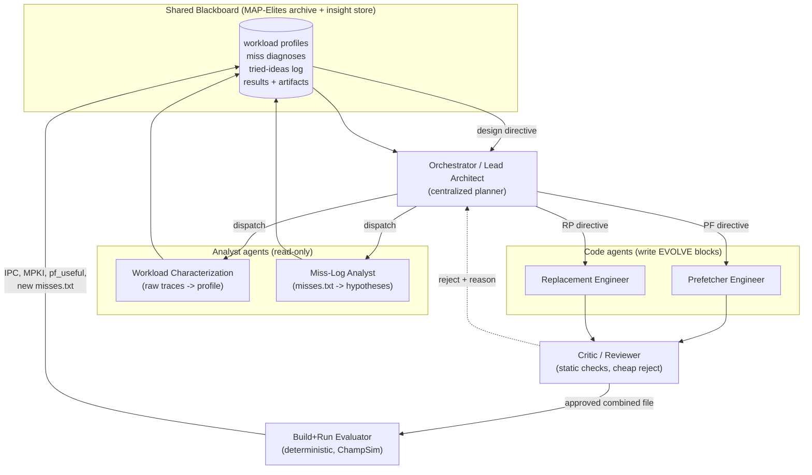
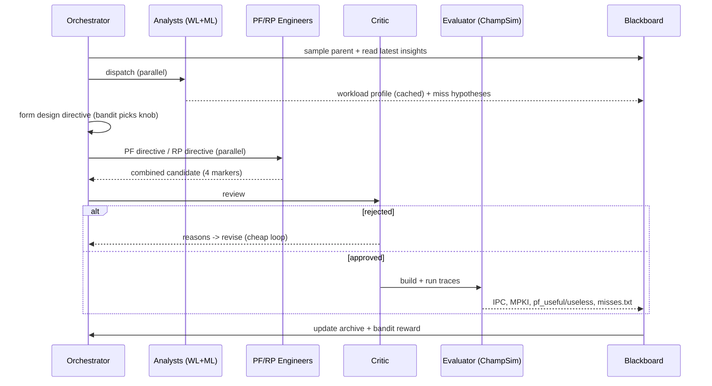

# Multi-Agent Co-Design of L2C Prefetcher + Replacement Policy

Design doc for a multi-agent system that **co-optimizes the L2 cache prefetcher and
replacement policy** in ChampSim, layered on top of the existing OpenEvolve loop.

Status: proposal / design. Owner: (you). Last updated: see git.

---

## 1. Motivation

Today the repo evolves cache logic with a single mutation LLM driven by OpenEvolve:

- `workflows/combined/` already **co-evolves** the L2C prefetcher and replacement
  policy in one source file split by markers, built as two ChampSim translation
  units (TUs). The two halves cannot share C++ globals; they can only cooperate
  through the `metadata` channel (`metadata_in` returned by
  `prefetcher_cache_operate` and consumed in `replacement_cache_fill`).
- `openevolve-components/evaluator.py` builds ChampSim, runs traces in parallel,
  and reports **only `cumulative IPC`** as the score.
- The mutation LLM gets a static context bundle (`context_agent.py` /
  `internal_agent.py`) that just dumps a few ChampSim headers
  (`address.h`, `champsim.h`, `modules.h`, `cache.h`).

Limitations this design addresses:

1. **The optimizer is "blind" to *why* a candidate is slow.** It sees IPC, not
   *which PCs miss*, *which prefetches are useless*, or *which evictions kill
   reuse*. ChampSim already produces this data (`--miss-log` → `misses.txt`,
   and `pf_useful/pf_useless/...` in `cache_stats`) but it is thrown away.
2. **Prefetcher and replacement are mutated by the same undifferentiated prompt.**
   There is no specialist reasoning about the coupling between them (prefetch-aware
   insertion, dead-prefetch demotion, confidence-driven RRPV).
3. **No workload-awareness.** The same edits are tried regardless of whether the
   trace is streaming (`perlbench`), branchy/irregular (`gcc`), or
   pointer-chasing/memory-bound (`mcf`).

The proposal: a **centralized orchestrator** coordinating several **specialist
agents** (workload analyst, miss-log analyst, prefetcher engineer, replacement
engineer, critic) that feed a **closed-loop, signal-rich** version of the existing
evolutionary search.

---

## 2. Goals & non-goals

**Goals**

- Co-design PF + RP for the **L2C** (`L2C` module hooks already wired in
  `workflows/combined/champsim_config.json`).
- Close the loop on **real ChampSim diagnostics** (miss log, prefetch
  usefulness, MPKI, miss latency), not just IPC.
- Keep specialist agents that (a) characterize workloads from raw traces,
  (b) analyze miss logs, (c) edit PF code, (d) edit RP code, all under
  (e) one orchestrator.
- Reuse — not replace — the existing build/run pipeline and the MAP-Elites
  population so we keep diversity, islands, and checkpointing.

**Non-goals (for v1)**

- Changing ChampSim core or the submodules (all coupling stays in
  `openevolve-components/` and `workflows/`, per the repo convention).
- Designing hardware-realizable RTL. We optimize the C++ behavioral models.
- Replacing OpenEvolve's database/selection logic.

---

## 3. Where agents plug into the existing system

The cleanest integration is **"agents as the mutation operator + advisors,"
OpenEvolve as the population engine + evaluator.** Three increasingly ambitious
modes:

| Mode | What changes | Risk |
|------|--------------|------|
| **A. Advisor** | Replace `fetch_context_from_agent` with a multi-agent *Insight Service* that appends a structured workload + miss diagnosis to the existing combined-workflow prompt. Mutation still done by OpenEvolve's single LLM. | Low. Almost no change to the loop. |
| **B. Agentic mutation** | The orchestrator (PF engineer + RP engineer + critic) *produces the child candidate* (a combined file using the existing split markers) instead of the single mutation LLM. OpenEvolve still selects parents and stores results. | Medium. |
| **C. Full orchestration** | Orchestrator runs its own strategy (bandit over "which knob to turn"), maintains a blackboard, does attribution, and calls the evaluator directly; OpenEvolve's MAP-Elites archive becomes the long-term memory. | Higher. |

**Recommendation:** ship A first (it is days of work, not weeks, and immediately
makes the existing loop smarter), then graduate to C. B/C reuse the same agent
implementations from A.

### Concrete hook points in this repo

- Insight injection: `openevolve/openevolve/context_agent.py::fetch_context_from_agent`
  is already called by the prompt sampler. Make it return the multi-agent bundle.
- Agentic mutation (mode B/C): wrap or replace the diff-producing step. The
  combined evaluator already knows how to split a combined file
  (`workflows/combined/evaluator.py::split_combined_source`), so agents only need
  to emit a file with the four markers.
- Evaluation stays in `openevolve-components/evaluator.py` (extended, see §6).

---

## 4. Architecture

### 4.1 Agents

1. **Orchestrator / Lead Architect (centralized).**
   - Picks the parent program (from the MAP-Elites archive), decides the
     per-round objective: *PF-only*, *RP-only*, or *joint* edit, and a concrete
     **design directive** (hypotheses + constraints) derived from the blackboard.
   - Allocates LLM/compute budget, dispatches analysts and engineers, runs the
     critic gate, and routes the result to the evaluator.
   - Maintains a **strategy policy** (start with a simple multi-armed bandit over
     knob categories; reward = IPC delta or MPKI reduction). This is what makes
     it "smart" over many rounds.

2. **Workload Characterization Agent (read-only, analyst).**
   - Input: raw ChampSim traces (`*.champsimtrace.xz`) or, preferably,
     pre-computed offline stats (cheaper, deterministic).
   - Output: a compact **workload profile** per trace:
     - access-pattern taxonomy: streaming / constant-stride / complex-stride /
       pointer-chasing / irregular;
     - reuse-distance histogram (drives replacement strategy);
     - spatial locality / page-crossing stride frequency (drives PF degree &
       cross-page logic);
     - memory-boundedness (LLC MPKI, fraction of stall cycles);
     - per-PC delta distribution summary.
   - The profile is essentially static per trace → **compute once, cache** in the
     blackboard. Re-run only when the trace set changes.

3. **Miss-Log Analysis Agent (read-only, analyst).**
   - Input: `misses.txt` produced via ChampSim `--miss-log` (per
     `(cpu, pc, address)` demand-miss counts; see `inc/cache_stats.h`
     `pc_address_misses` and `src/main.cc` `--miss-log`), plus a **baseline**
     miss log (no/weak prefetcher) for "what is even prefetchable."
   - Output: ranked, actionable **hypotheses**, e.g.:
     - hot PCs and their dominant address deltas → "PC `0x402dc0` misses on a
       `+0x1000` cross-page stride → enable cross-page stride prefetch";
     - miss clustering by set/region → likely **conflict** (fix via replacement)
       vs **capacity** (fix via better victim selection / bypass) vs
       **compulsory** (fix via prefetch coverage);
     - PF **coverage gap**: misses that the current PF should have caught
       (compare candidate miss log vs its prefetch targets);
     - PF **pollution**: regions where `pf_useless` is high.
   - This agent is the heart of "some agents look at miss-logs."

4. **Prefetcher Engineer Agent (writes the PF EVOLVE block).**
   - Edits only the `// === OPENEVOLVE_PREFETCHER_BEGIN/END ===` section.
   - Receives the design directive + relevant API context (the headers
     `internal_agent.py` already serves) + miss/workload insights.
   - Knows the toolbox: stride/IP tables, GHB, delta tables, degree/distance
     throttling, MPKC gating, cross-page handling, confidence encoded into
     `metadata`.

5. **Replacement Engineer Agent (writes the RP EVOLVE block).**
   - Edits only the `// === OPENEVOLVE_REPLACEMENT_BEGIN/END ===` section.
   - Toolbox: RRIP/DRRIP/SHIP-style insertion, set-dueling (`get_set_sample_category`
     is available), **prefetch-aware insertion** (use the `metadata`/`prefetch`
     flag in `replacement_cache_fill`), dead-block prediction, reuse-distance-aware
     RRPV.

6. **Co-design coupling (a responsibility, owned by the orchestrator).**
   The PF and RP halves are separate TUs and **must not share globals** (README
   constraint). All cooperation flows through the `metadata` channel:
   - PF encodes *prefetch type + confidence* into the returned metadata;
   - RP reads it in `replacement_cache_fill` to choose insertion RRPV
     (e.g., low-confidence prefetch → inserted "near-eviction"; demand or
     useful-prefetch → protected).
   The orchestrator's directive explicitly tells PF and RP which metadata
   contract to use this round so the two edits stay compatible.

7. **Critic / Reviewer Agent (cheap gate before expensive builds).**
   - Static review for the repo's hard constraints (from `config.yaml` system
     message): API discipline, bounded state, init-in-`*_initialize`, no I/O,
     no UB/OOB, no shared globals across the two halves, markers intact.
   - Rejecting here saves a full ChampSim rebuild+run per bad candidate.

8. **Build + Run Evaluator (deterministic, not an LLM).**
   - The existing `openevolve-components/evaluator.py` extended to emit richer
     signals (§6). Returns IPC + MPKI + prefetch usefulness + a fresh
     `misses.txt` that feeds the miss-log agent next round.

9. **Blackboard / shared memory.**
   - Static layer: workload profiles (cached), API/context snippets.
   - Dynamic layer: per-candidate results, miss diagnoses, and a **tried-ideas
     log** (so the orchestrator stops re-proposing dead ends). Naturally maps onto
     OpenEvolve's MAP-Elites database + artifacts.

### 4.2 Per-generation control loop

---

## 5. Co-design ideas worth encoding as agent "plays"

Give the engineers/orchestrator a library of named strategies so reasoning is
concrete and attributable:

- **Prefetch-aware RRIP insertion.** PF tags each prefetch with a confidence
  level in `metadata`; RP inserts high-confidence prefetches with a protected
  RRPV and low-confidence ones at `maxRRPV` (near-eviction). The seed RP already
  special-cases writes — extend to the prefetch flag.
- **Dead-prefetch demotion.** If `pf_useless` is high for a region (from the
  miss log / fill stats), RP evicts un-touched prefetched lines first.
- **Coverage/accuracy throttle handshake.** Workload profile says "streaming" →
  PF raises degree/distance and RP switches to a streaming-friendly insertion
  (e.g., bimodal/BRRIP) to avoid thrash; "pointer-chasing" (mcf) → PF leans on
  delta/temporal correlation and RP protects reused lines.
- **Conflict vs capacity routing.** Miss-log agent labels hot sets as
  conflict-dominated → RP edit (set-dueling, better victim); capacity-dominated →
  PF edit (timeliness, bypass) — so the orchestrator picks the right specialist.
- **Bypass on low reuse.** RP bypasses/insert-at-eviction for lines flagged
  low-reuse by the reuse-distance histogram.

---

## 6. Required ChampSim/evaluator instrumentation (data plumbing)

The single biggest enabler is **turning IPC-only feedback into rich feedback**.

- **Enable `--miss-log` per candidate.** Add the flag to the run command in
  `_run_champsim` (`openevolve-components/evaluator.py`) writing to a
  per-candidate path; surface that path as an artifact so the miss-log agent can
  read it next round.
- **Parse richer stats from ChampSim stdout** (currently only `cumulative IPC`):
  L2C/LLC **MPKI**, **prefetch accuracy/coverage** (`pf_useful`, `pf_useless`,
  `pf_issued`), average **miss latency** (`total_miss_latency_cycles` is already
  tracked in `cache_stats`). Add these to `metrics` and `artifacts`.
- **Baseline miss log.** Generate one no-prefetcher / LRU run per trace up front;
  store as the "prefetchable upper bound" reference in the blackboard.
- **Offline trace profiler.** A standalone script that reads a
  `*.champsimtrace.xz` once and emits the workload profile JSON (stride/reuse/
  page-crossing stats). Keeps the workload agent cheap and deterministic.

---

## 7. MAP-Elites features & credit assignment

- **Feature dimensions** (for diversity in co-design space): e.g.
  `(prefetch_coverage_bin, prefetch_accuracy_bin, replacement_family, code_size)`.
  This stops the search from collapsing onto one PF/RP combo.
- **Attribution.** To know whether IPC came from the PF or the RP edit, support
  **ablation runs**: PF-new + RP-baseline, PF-baseline + RP-new, both-new. Use the
  marginal deltas as the bandit reward signal for the orchestrator's knob choice.
  (Optional in v1; valuable for steering.)

---

## 8. Implementation choices

- **Framework.** LangChain/LangGraph is already a (soft) dependency
  (`internal_agent.py` uses `create_agent`/`ChatOpenAI`). **LangGraph** fits the
  "central orchestrator + worker agents + shared state" graph directly and gives
  checkpointable state. Alternatives: plain `asyncio` + function-calling (lowest
  dependency), OpenAI Agents SDK, AutoGen, or CrewAI. Recommendation: LangGraph
  for the orchestrator graph, keep the deterministic evaluator outside the graph.
- **Determinism & cost.** Analysts run on cached/offline data; only engineers and
  the critic are on the hot path each generation. Cache workload profiles; only
  re-diagnose the miss log when a new `misses.txt` exists.
- **Failure handling.** Reuse the evaluator's existing artifact surfacing (build
  logs, timeouts) — feed compile errors straight back to the responsible engineer
  agent (PF vs RP) rather than the whole prompt.

---

## 9. Phased rollout & TODOs

### Phase 0 — Instrumentation (no agents yet)
- [x] Add `--miss-log <path>` to the ChampSim invocation in
      `_run_champsim` (`openevolve-components/evaluator.py`); write per-candidate.
- [x] Extend `_parse_ipc` → `_parse_stats`: also capture L2C/LLC MPKI,
      `pf_useful`/`pf_useless`/`pf_issued`, avg miss latency. Add to `metrics`.
- [x] Generate & store **baseline** (LRU, no/weak PF) miss logs + stats per trace.
- [x] Write `scripts/profile_trace.py`: raw trace → workload-profile JSON
      (stride/reuse-distance/page-crossing/memory-boundness). Cache outputs.
- [x] Document the artifact paths in `workflows/combined/README.md`.

### Phase 1 — Advisor mode (Mode A; smallest viable multi-agent)
- [x] Implement **Workload Characterization Agent** (reads profile JSON → prose
      profile + recommended PF/RP strategy bias).
- [x] Implement **Miss-Log Analysis Agent** (reads `misses.txt` + baseline →
      ranked hypotheses with target PCs/regions and conflict/capacity/compulsory
      labels).
- [x] Build the **Insight Service** that merges both into one bundle and wire it
      into `context_agent.py::fetch_context_from_agent` (replacing the static
      header dump) for the combined workflow.
- [ ] Run the existing combined loop end-to-end; confirm insights appear in
      prompts and IPC is non-regressing on `perlbench`/`gcc`/`mcf`.

### Phase 2 — Agentic mutation (Mode B)
- [x] Implement **Prefetcher Engineer** and **Replacement Engineer** agents that
      emit edits scoped to their marker block, given the design directive +
      API context + insights.
- [x] Implement **Critic / Reviewer** agent enforcing the §4.1(7) constraints
      and marker integrity; cheap reject loop before build.
- [x] Implement a merge step that produces a valid combined file
      (reuse `split_combined_source` to validate round-trip).
- [x] Swap this in as the mutation operator for the combined workflow; keep
      OpenEvolve parent selection + archive.

### Phase 3 — Orchestrator & co-design coupling (Mode C)
- [x] Implement the **Orchestrator** (LangGraph): parent selection hook, directive
      synthesis, dispatch, critic gate, evaluator call.
- [x] Add the **strategy policy** (multi-armed bandit over knob categories:
      PF-coverage / PF-timeliness / RP-insertion / RP-victim / metadata-contract).
- [x] Define and enforce the **metadata contract** between PF and RP each round
      (confidence encoding ↔ insertion RRPV).
- [x] Implement the **blackboard** (workload cache + tried-ideas log + results),
      backed by / mirrored into the MAP-Elites archive.
- [x] Encode the §5 "plays" as selectable strategies.

### Phase 4 — Rigor, attribution, scaling
- [ ] Add **ablation runs** (PF-only / RP-only / both) for credit assignment;
      feed marginal IPC/MPKI deltas back as bandit reward.
- [ ] Add MAP-Elites **feature dimensions** for co-design diversity (§7).
- [ ] Multi-trace generalization: score on a held-out trace to avoid overfitting
      to a single workload; report per-trace + aggregate.
- [ ] Caching/parallelism: dedupe identical candidates, cache builds, cap agent
      token budgets; add cost/latency dashboards.
- [ ] Regression guard: every accepted candidate must beat the running best on the
      aggregate metric, else archived-not-promoted.

---

## 10. Risks & open questions

- **Two-TU isolation.** PF/RP cannot share C++ state; all coupling must go through
  `metadata`. Agents must be constrained to respect this (critic enforces).
- **Reward noise / overfitting to one trace.** Mitigate with multi-trace scoring
  and held-out evaluation (Phase 4).
- **Cost.** More agents = more LLM calls. Keep analysts off the hot path (cache),
  and gate builds with the critic.
- **Attribution is genuinely hard** without ablations; decide whether Phase-4
  ablation cost is worth the steering benefit for your trace set.
- **Open question:** should the orchestrator drive its own search loop (Mode C)
  or remain a mutation operator inside OpenEvolve? Recommendation: stay inside
  OpenEvolve through Phase 3; only externalize if the bandit needs control over
  parent selection.
